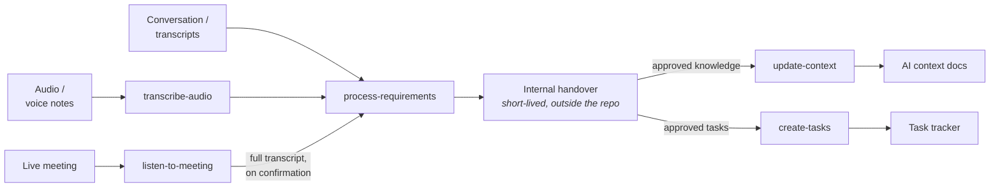

<p align="center">
  
</p>

# winnow

Agent skills for managing a software product's requirements and roadmap. They distil brainstorming conversations and meeting transcripts into two kinds of output — durable project knowledge and tracker-ready tasks — agreed with the user in conversation before anything permanent changes.

The package is agent-agnostic: it is distributed with [APM (Agent Package Manager)](https://microsoft.github.io/apm/), so the same skills deploy to Claude Code, GitHub Copilot, Cursor, Codex, and any other harness APM supports. This repo is both the package and the marketplace that serves it.

## Why "winnow"?

Winnowing is one of farming's oldest techniques: after threshing, the harvest is tossed into the air from a broad, shallow basket — a *winnow*, or winnowing fan — so the wind carries off the light chaff while the heavy grain falls back into the basket. Same crop goes up; only what nourishes comes down.

That is precisely what these skills do to a conversation. A meeting transcript or a brainstorm gets tossed into the air, scrutiny blows the small talk and noise away, and two kinds of grain fall back to be kept: knowledge worth recording and work worth doing. The logo is a winnowing basket mid-toss.

## The pipeline

The core pipeline is three skills, split along a separation of concerns: distilling knowledge from a source and deciding where it belongs is one job; applying it to its destination is another. Two further skills feed the pipeline with audio: **transcribe-audio** turns recordings into transcripts locally, and **listen-to-meeting** accompanies a live meeting. A companion **setup-audio** skill prepares the machine for both — **run it once per machine before first audio use**, so model downloads, native compilation, and permission prompts happen at a calm moment instead of the start of a meeting. Before applying anything, the skills summarise what is about to happen:



### process-requirements

Works conversationally, whether the input is a live brainstorm or one or more meeting transcripts (inline, as files, as links provided a tool with access exists, or as audio recordings transcribed via transcribe-audio) worked through with the user. It triages everything into three buckets:

- **irrelevant** — discarded; the skill lists what it dropped when presenting its findings, and keeps no record beyond that;
- **durable knowledge** — things anyone working on the project later would need, destined for the AI context;
- **actionable work** — concrete tasks with a done-state and a why, destined for the tracker.

It actively hunts gaps, conflicts, and ambiguity, and asks the user rather than inventing answers. Its output is an internal proposal handed to the other two skills — never a direct edit to docs or tracker.

### update-context

Applies a proposal's approved knowledge to the project's AI context documentation. It first checks whether the project has its own documentation-management machinery — instructions, skills, plugins, or scripts — and delegates to that where it exists, respecting its workflow and checkpoints. Failing that, it requires the project to define which knowledge belongs in which document (a *doc map*); if none exists it halts and asks the user to cancel or define one. Its writing rules keep documents from decaying under repeated updates: integrate rather than append, match the document's voice, describe present state only, and re-read the whole document after editing.

### create-tasks

Turns a proposal's approved tasks into tickets. It discovers the tracker and its tooling (CLI, MCP server, API credentials) from the project's own documentation, probes access non-destructively, and stops with a precise report if anything is missing. If more than one tracker is plausible, it asks — it never assumes. Ticket defaults, overridable by project conventions: business goal first, dedupe against existing tickets, check for conflicts, one goal per ticket (splits confirmed with the user), and independent tickets wherever possible with tracker-native dependency links otherwise.

### transcribe-audio

Converts audio to text entirely on the local machine with a Whisper-family model ([faster-whisper](https://github.com/SYSTRAN/faster-whisper)) — no hosted transcription service, no account, no data leaving the machine (the model weights download once, then it works offline). **File mode** turns a complete recording — a WhatsApp voice note, an exported meeting recording — into a transcript in one shot; process-requirements uses this to accept audio directly. **Streaming mode** turns a live PCM feed into finalized transcript segments as they become stable; listen-to-meeting builds on it. The only prerequisite is [uv](https://docs.astral.sh/uv/): the bundled script declares its own dependencies inline, so nothing is installed into the host project.

### listen-to-meeting

Listens to a meeting *while it happens* — the user's microphone and the system audio carrying the other participants, captured as two separate channels through the OS's own facilities (a Core Audio system-audio tap on macOS — audio only, no screen access — WASAPI loopback on Windows, PulseAudio/PipeWire monitor on Linux) — and does one narrow job: flag contradictions the room hasn't noticed, live, so they can be resolved on the spot. Explicit corrections are tracked silently; only genuinely unacknowledged conflicts, contradictions of recorded context, or build-changing ambiguities are surfaced, and the threshold is deliberately biased toward silence. It first verifies the whole capture path for the host OS and, if anything is missing, hands over to setup-audio rather than starting a partial session. When the user says the meeting is over, it proposes running process-requirements on the full transcript — the formal pipeline is never run live and never auto-chained.

### setup-audio

One guided, idempotent pass that gets a machine ready for the two audio skills: it verifies [uv](https://docs.astral.sh/uv/) and the Python audio stack, compiles the macOS capture helper, walks the user through the OS permission, offers the one-time Whisper model download (~500 MB, cached per machine and shared by every project on it), and finishes with a live self-test — a short tone through the speakers proving that audio actually flows on both channels, not just that permissions claim to be granted. Recommended once per machine before first audio use; the audio skills also invoke it themselves when they find something missing. It ships no tooling of its own — it drives the same commands the other skills use.

## The proposal file

The handoff between skills is an internal, short-lived file the user never needs to read — winnow's plumbing, not a deliverable. It is kept **outside the consuming repo**, so the pipeline leaves no footprint in the host project — no working folders, no gitignore entries. Proposals live in the coding agent's own scratchpad/staging area when the harness provides one, falling back to `/tmp/winnow/<repo-folder-name>-<hash>/proposals/` otherwise (the hash is derived from the repo's absolute path so every skill in the pipeline finds the same directory). They are **short-lived**: a proposal exists for the duration of a processing run — minutes, maybe hours — and the skills delete it once everything in it has been applied or created. It holds only what the user approved in conversation; anything not approved never makes it into the file. The durable records are the AI context and the tracker, not the proposal.

## What a consuming repo must provide

The skills assume they run inside a mono/meta-repo that carries the project's durable knowledge:

- **An AI context** — an "advanced README" (e.g. `AGENTS.md`, `CLAUDE.md`, `docs/`) covering the project's purpose, domain, tech stack, and conventions. Its goal: people and AI alike know how to work on the project after reading it.
- **A doc map** — an indication of which kind of knowledge belongs in which document. This may be explicit meta-documentation, or implicit in the structure of the README, `CLAUDE.md`, `AGENTS.md`, or similar. Without either, update-context refuses to guess.
- **A named task tracker** — the context must say where tasks live and, ideally, how to interact with it (cheatsheets, templates, conventions). The skills are fully tracker-agnostic; the project's docs are the only source of tracker knowledge.

Where any of these is missing, the skills surface the gap instead of working around it — and offer to record the answer so the gap closes permanently.

## Installation

### With APM

Directly as a dependency in your project's `apm.yml`:

```yaml
dependencies:
  apm:
    - quiram/winnow
```

Or via the marketplace this repo publishes:

```bash
apm marketplace add quiram/winnow
apm install winnow@winnow
apm install
```

### As a Claude Code plugin

The generated `.claude-plugin/marketplace.json` makes this repo a Claude Code marketplace too:

```
/plugin marketplace add quiram/winnow
/plugin install winnow@winnow
```

## Working on winnow itself

See [CONTRIBUTING.md](CONTRIBUTING.md) for the repo layout and release process.
